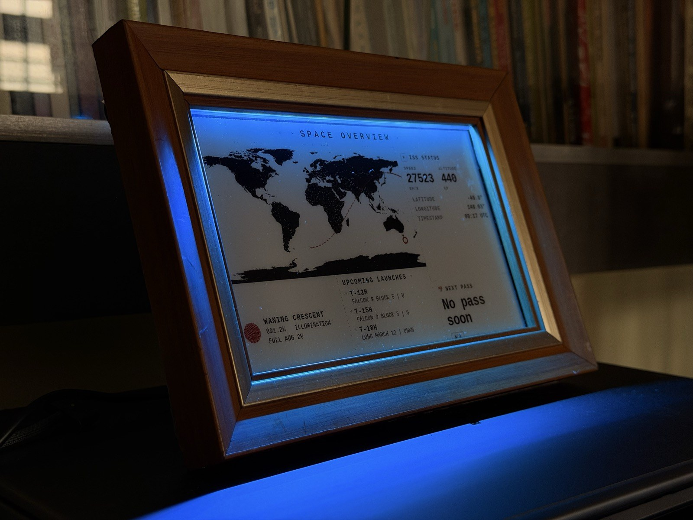
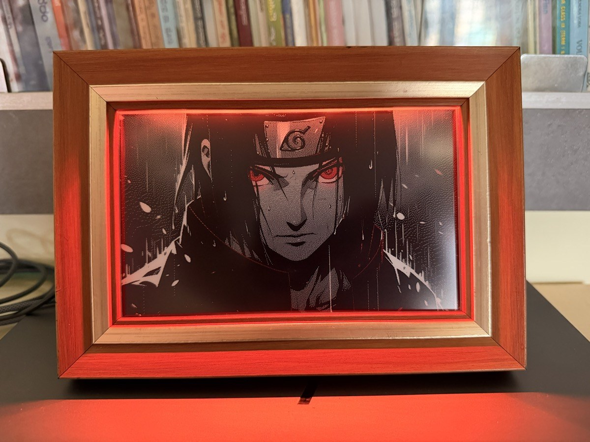
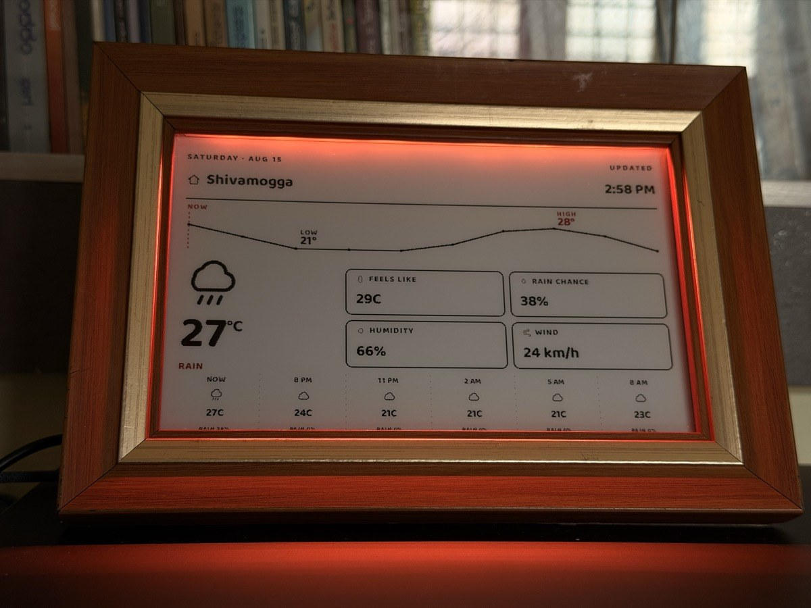
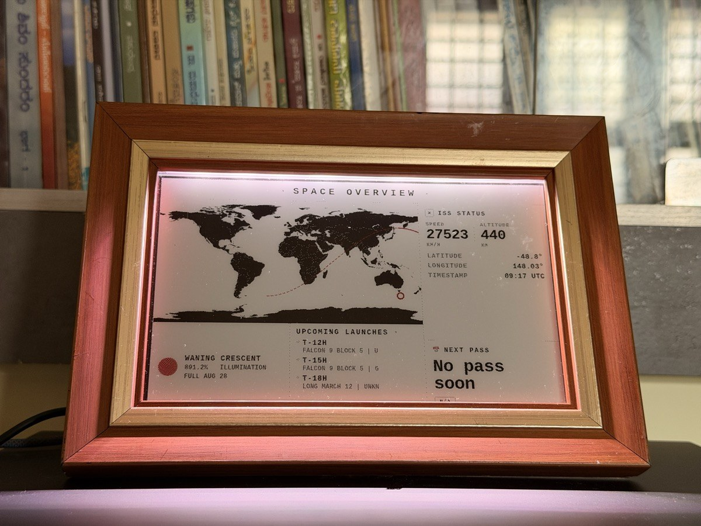
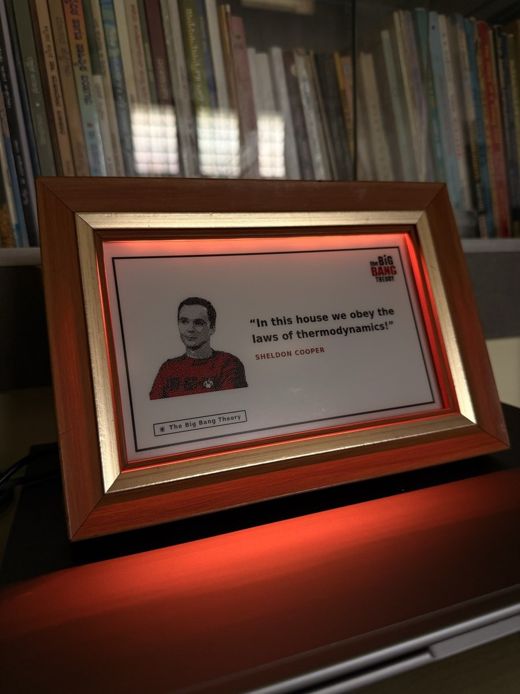

# ZenBoard

<p align="center">
  
</p>

A personal e-ink dashboard, built on top of [InkyPi](https://github.com/fatihak/InkyPi),
running on a Raspberry Pi Zero 2W with a Waveshare 7.5" tri-color (black/white/red)
e-ink panel in a wooden frame, plus a WS2812B LED accent strip.

Full build documentation — hardware, display calibration, every custom plugin, and the
gotchas we hit along the way — lives in **[docs/ZENBOARD.md](./docs/ZENBOARD.md)**.

## What it shows

Custom plugins built for this board, cycling on a schedule:

- **Apple Calendar** — iOS-style month grid, imports any ICS/iCal feed (Google, iCloud,
  Outlook), red/black theme
- **System Health** — Pi vitals: CPU/temp/memory/disk, per-core load, power/throttle
  status, network, daily e-ink refresh count
- **Stock Tracker** — ticker + sparkline chart, free Yahoo Finance data, light/dark mode
- **Weather** — current conditions, hourly temperature bars, and an air-quality panel:
  US/EU AQI with a band scale, PM2.5, PM10, CO2, ozone, NO2 and UV. Karnataka-focused
  searchable locations. Weather from OpenWeatherMap, air quality from Open-Meteo (keyless)
- **TV Quotes** — random quotes with character art
- **Flights Overhead** — live ADS-B aircraft near the house, drawn as side-profile
  technical illustrations by aircraft type. Keyless data from adsb.lol
- **Energy Markets** — Brent, WTI and natural gas with trend charts and a 52-week
  range marker, keyless via Yahoo Finance
- **Spotify Now Playing** — mirrors what's playing from a local Mac, since Spotify's
  official API gates the live-playback endpoint behind Premium
- **WiFi Setup** — shown automatically if the Pi can't find a known network: QR code to
  a captive setup portal, no monitor/keyboard needed
- **AI Image / AI Text** — free-tier generation (Hugging Face + Pollinations.ai,
  OpenRouter), no paid API required

## Hardware

- Raspberry Pi Zero 2W
- Waveshare 7.5" epd7in5b_V2 (black/white/red e-ink), 800×480
- WS2812B LED strip (22 pixels), driven off GPIO13
- Waveshare HMMD mmWave presence sensor (S3KM1110) on UART
- Wooden picture frame

## Presence sensing and LED behaviour

A Waveshare HMMD mmWave sensor (S3KM1110) watches the room. Unlike a PIR it detects a
stationary person, so the frame knows the room is occupied even when nobody is moving.

**Wiring.** 3V3, GND, and UART on `/dev/serial0` at 115200 8N1. The module also has an
OT2 presence pin, but UART is treated as authoritative — OT2 was observed latching high
for hours after the room had emptied.

`zenboard_sensor.py` is the single owner of the serial port. Only one process can read
it; two readers each receive a random half of the bytes and both see garbage.

### What the sensor can and cannot do

This module ignores every documented configuration command — no ACK at any baud rate —
so its factory defaults are permanent. It streams ASCII `ON` / `OFF` / `Range N` at
about 9.5 Hz and nothing else.

More importantly, it **reports** at 9.5 Hz but its internal estimate only **updates**
every 1–3 seconds; a measured capture showed one value repeated 30 times in a row. That
smoothing happens inside the module, before anything reaches the UART, which means:

- Sustained presence and distance: reliable. A palm held 5 cm away registered on 100% of
  samples, with zero false positives across 19 seconds of an empty room.
- Taps, gestures, any sub-second event: **not detectable.** A tap lasts 100–200 ms and is
  averaged away before transmission. Five taps three seconds apart produced no periodicity
  whatsoever (autocorrelation r = −0.04 at the 3 s lag).

`tools/sensor_scope.py` serves a live browser view of the raw stream — value, report rate
versus change rate, hold plateaus, histogram, and any unparsed lines — which is how the
above was established rather than assumed.

### Driving the LEDs

The sensor writes a `proximity` value (0.0 to 1.0) into the runtime LED config, mapping
distance so the strip is at full effect within about 1 m and idle beyond about 4 m. The
curve is gamma-corrected (gamma = 2.0): WS2812 PWM is linear while perception is not, and
without the correction the fade drops off a cliff instead of feeling even.

The `dist_*` LED effects scale themselves by that value:

| Effect | Behaviour as you approach |
|---|---|
| `dist_fade` | Chosen colour brightens |
| `dist_hue` | Hue shifts across the strip |
| `dist_ember` | Warm ember glow intensifies |
| `dist_breathe` | Breathing speeds up |
| `dist_aurora` | Aurora bands tighten |
| `dist_velocity` | Responds to speed of approach rather than distance |

Smoothing is deliberately done in exactly one place. The renderer eases proximity at 0.22
per frame at about 33 Hz, roughly a 0.9 s glide. An earlier version also slew-limited the
value at the sensor end, and the two compounded into a ~3 s lag that felt broken.

The sensor never overrides the LED mode chosen in the web UI or Home Assistant. It writes
only the runtime config, never the persisted one, so a continuous 10 Hz effect cannot spam
Home Assistant with state changes or overwrite the chosen colour and brightness.

### Room-empty behaviour

Presence is deliberately not used to refresh on every entry — mmWave sees through walls,
and an early version repainted the panel seven times overnight. Behaviour is tiered:

| Away for | On return |
|---|---|
| under 30 min | nothing; whatever was on the panel stays |
| over 30 min | refresh to the next plugin in the schedule |
| over 1 hour | refresh plus an AI-generated greeting for the time of day |

The LEDs begin fading once the room has been empty for 30 minutes, reaching full dark over
the following 10 minutes.

### Home Assistant

Both entities are published over MQTT with discovery, grouped under one `ZenBoard` device:

| Topic | Payload | Retained |
|---|---|---|
| `zenboard/presence/state` | `ON` / `OFF` | yes |
| `zenboard/distance/state` | integer cm | no |
| `zenboard/presence/availability` | `online` / `offline` | yes, via LWT |

## Setup

This is a fork of InkyPi, so the underlying install process is the same:

```bash
git clone https://github.com/swaroopdeshpande/ZENBoard.git
cd ZENBoard
sudo bash install/install.sh -W epd7in5b_V2
```

See [installation.md](./docs/installation.md) for the general InkyPi install walkthrough,
and [ZENBOARD.md](./docs/ZENBOARD.md) for the calibration and configuration specific to
this build (display margins, `image_settings`, the plugins above, etc.) — you'll want to
recalibrate the display margins for your own frame rather than reuse the values checked
in here.

## Gallery

<p align="center">
  
  
</p>
<p align="center">
  
  
</p>

## Credits

Built on [InkyPi](https://github.com/fatihak/InkyPi) by [fatihak](https://github.com/fatihak)
— an open-source, plugin-based e-ink dashboard framework. See
[building_plugins.md](./docs/building_plugins.md) if you want to write your own plugin,
and the original project for the general plugin ecosystem, playlist scheduling, and
supported display list.

## License

Distributed under the GPL 3.0 License, see [LICENSE](./LICENSE) for more information.
This project includes fonts and icons with separate licensing and attribution
requirements — see [Attribution](./docs/attribution.md) for details.
